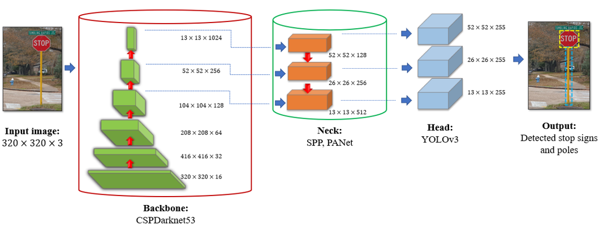
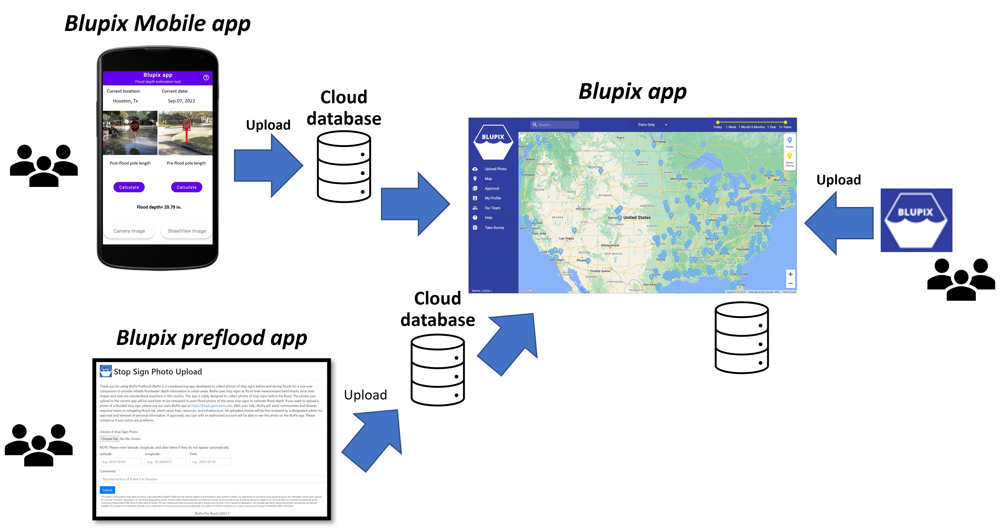

# Project Blupix

Thank you for using BluPix! The photos you take and share on our crowdsourcing applications will help your community better document and understand the impact of floods in your area. Our models compare pre-flood and post-flood photos of the same location to estimate the depth of floodwater in that particular location. We use traffic signs as benchmarks since their shapes and sizes are standardized anywhere in the country. With your help, BluPix will assist communities and disaster response teams in mitigating flood risk, which saves lives, resources, and infrastructure.

| Product  | Description | Link |
| ------------- | ------------- | ------------- |
| Blupix app  | A crowdsourcing web application for collecting photos of flooded stop signs. This web app uses AI algorithms to calculate flood depth based on the size of stop signs and generate a flood depth map. | [https://blupix.geos.tamu.edu/]
| Blupix Preflood  | A crowdsourcing web application for collecting photos of stop signs. | [https://blupix-image.geos.tamu.edu/]
| Blupix Mobile  | An Android mobile app for real-time flood depth estimation in urban areas. | [https://github.com/ciber-lab/blupix/tree/main/blupix-mobile]
| Blupix Dataset  | Annotated photos of stop signs before and after flood. | [https://github.com/ciber-lab/blupix/tree/main/blupix-dataset]

## The core concept of flood depth estimation:

Traffic signs are used in this study as standard visual benchmarks. Unlike sophisticated flood measurement sensors, traffic signs are omnipresent and easy to identify. Stop signs, in particular, can be found in many intersections in urban and rural areas. In the U.S., traffic sign shapes and dimensions are laid out in the Manual on Uniform Traffic Control Devices (MUTCD) and its companion volume, Standard Highway Signs (SHS) (Federal Highway Administration, 2004). The size of a stop sign may slightly vary depending on the location it is installed; 30×30 inches in single-lane roads (almost all residential neighborhoods), and 36×36 inches in multi-lane conventional roads and expressways. While the shape and dimensions of the sign itself is standardized, the pole that holds it may or may not be regulated and can be made of different material and have different length.

To estimate flood depth using our approach, a pair of pre- and post-flood street photos taken by ordinary handheld devices (e.g., smartphones, tablet computers, digital cameras) will be processed by the computer vision model (a cutomized YOLOv4 model trained on the Blupix training set) and the output is the depth of floodwater in the location where the photos were taken. While images can be taken from different angles and different distances from the water surface, to measure the depth of the flood, the model relies on the dimensions of a known benchmark visible in the image, for which the real size (e.g., in inches) is known. Image processing and computer vision are then used to determine the size of this benchmark in pixels and calculate a constant measurement ratio (e.g., inches to pixel), which in turn, is used to convert all other measurements from pixel to standard units (e.g., inches).

The depth of floodwater, i.e., d_w, can be calculated as the difference between pole lengths in a pair of pre- and post-flood photos. In figure below, knowing the height of the sign octagon in both pixels (s) and in inches (30"), the constant ratio r is obtained as 30⁄s , indicating the number of inches corresponding to one pixel in the post-flood photo. Using this ratio, the length of the pole above waterline is calculated as r×p, in which p is the pole length in pixels. Similarly, knowing the height of the sign octagon in pixels (s') and inches (30", same as before), the constant ratio r' is obtained as 30⁄s', indicating the number of inches corresponding to one pixel in the pre-flood photo. Using this ratio, the full length of the pole (with no floodwater) is calculated as r'×p', in which p' is the pole length in pixels. Note that ratios r and r' are not necessarily equal since the two photos could be taken at different angles and distances from the stop sign. 

     𝑃(𝑖𝑛)=(30/36(𝑖𝑛))/(𝑆(𝑝𝑖𝑥))×𝑃(𝑝𝑖𝑥)

     𝑃′(𝑖𝑛)=(30/36(𝑖𝑛))/(𝑆′(𝑝𝑖𝑥) )×𝑃′(𝑝𝑖𝑥)

     𝑑_𝑤(𝑖𝑛)=𝑃 (𝑖𝑛)−𝑃′(𝑖𝑛)

## The connection between Blupix app, Blupix Mobile app, and Blupix Preflood app:

- The Blupix app serves as the main platform, accessible via a dedicated website [https://blupix.geos.tamu.edu], where people can upload photos of flooded traffic signs using their mobile devices or computers. Users can manually pair uploaded photos with corresponding pre-flood photos by entering the location of the traffic sign in GSV. The app admin reviews uploaded photos, and subsequently feeds them to a computer vision model for further analysis. The output of this step is the estimate of flood depth, which is also reported on the map alongside the pre- and post-flood photos of the stop sign. Given an uploaded photo pair, if only the post-flood photo is approved by the admin, only the post-flood photo will be pinned on the map which can be paired with the correct pre-flood photo later by the same or other users.
- Blupix Mobile, on the other hand, is a mobile app that enables users to take a photo of a flooded traffic sign while the app automatically pairs it with the GSV view of the same traffic sign using GPS and accelerometer data of the mobile device. Upon the completion of the pairing process (which takes only a few seconds), the mobile app provides instant flood depth information through its built-in computer vision model. Users can also upload their paired photo with the calculated flood depth to a cloud database, which is then reviewed by the admin and  pinned on the map. The Blupix Mobile app is available for Android devices and can be downloaded from the research lab’s GitHub page [https://github.com/ciber-lab/blupix/tree/main/blupix-mobile].
- Blupix Preflood is a crowdsourcing app for collecting pre-flood photos of stop signs prior to a flood event, accessible via a website [https://blupix-image.geos.tamu.edu]. Collecting pre-flood photos is useful for future pairing with post-flood photos in locations with limited GSV data or mobile data connectivity interruptions during floods. User-uploaded photos on this app are stored on a cloud database and pinned on the map as pre-flood photos. The app extracts the geospatial metadata of the uploaded photo (if any) to automatically populate the location field. If the metadata is not available, users should enter the location of the photo in the app. The app admin reviews all uploaded photos before they are pinned on the map.

## Credits:
This project is conducted at Texas A&M University under award #NA18OAR4170088 from the National Oceanic and Atmospheric Administration (NOAA), U.S. Department of Commerce. Study personnel are Dr. Amir Behzadan (Construction Science), Dr. Courtney Thompson (Geography), Dr. Zhe Zhang (Geography), and Dr. Michelle Meyer (Hazard Reduction and Recovery Center). Dr. Bahareh Alizadeh (Ph.D. graduate from Texas A&M University) developed and trained the computer vision models, developed Blupix Mobile app, Blupix dataset, and is responsible for reviewing and analyzing crowdsourced photos uploaded to the Blupix app, Blupix Preflood, and Blupix Mobile. Diya Li (Ph.D. Student at Texas A&M University) adminsters user interface and web components of Blupix app and Blupix Preflood.
