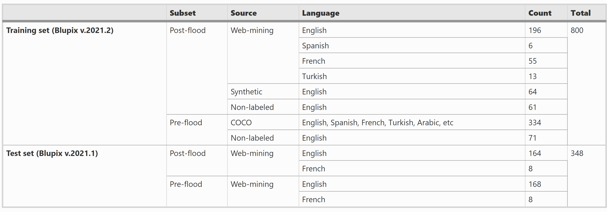

# Blupix Dataset

# Overview:

| Dataset  | Description | Link | Used in paper |
| ------------- | ------------- | ------------- | ------------- |
| Blupix train v.2021.2  | Contains 800 annotated photos of stop signs for training the object detection model | [https://blupix.geos.tamu.edu/] | 
| Blupix test v.2020.1  | Contains 186 annotated paired photos of stop signs (before and after a flood) for testing the object detection model | [https://blupix-image.geos.tamu.edu/]
| Blupix test v.2021.1  | Contains 225 annotated paired photos of stop signs (before and after a flood) for testing the object detection model| [https://github.com/ciber-lab/blupix/blob/main/blupix-mobile.md]
| Blupix test v.2022.1  | Contains 300 annotated paired photos of stop signs (before and after a flood) for testing the object detection model | [https://github.com/ciber-lab/blupix/blupix-dataset]

# Blupix trainining set
## Blupix train v.2021.2

# Blupix test set
This dataset is used for testing the trained model and consists of paired photos of stop signs (before and after a flood). The dataset contains information such as photo name (the photo ID), country, state and city (location of the stop sign in the photo), longitude and latitude (precise location of the stop sign), source (where photo is found), date taken (when the photo is taken), date saved (when the photo is added to the dataset), flood name (the name of the flood if known), searching keywords (keywords that were used to find the photos), post-flood link (the link for the post-flood photos), Google Street View link (the link to the Google Street View of the pre-flood photo), comment (any comment about the photo), and found by (the name of the study personnel). The last three columns in the dataset determines which photo exist in the three version of the dataset.

## Blupix test set versions
- Blupix test v.2020.1
Contains 186 paired photos of stop signs
- Blupix test v.2021.1
Contains 225 paired photos of stop signs
- Blupix test v.2022.1
Contains 300 paired photos of stop signs

