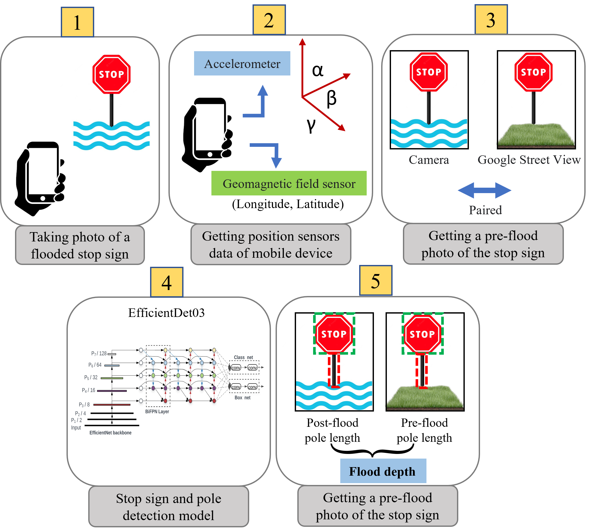

# Blupix Mobile

We introduce Blupix, a mobile application with embedded computing functionality for on-demand floodwater depth estimation from geocoded photos of submerged stop signs. Blupix allows the user to capture a photo of a submerged stop sign using the camera of the mobile device, automatically obtains and stores the geographical location and azimuth angles of the mobile device when the photo is taken, provides an interactive interface in Google Street View to locate the stop sign in a flood-free view, runs a light object detection model (EfficientDet03) trained to detect stop signs and poles and measure their sizes in pre- and post-flood images, and finally, calculates the depth of floodwater as the difference in pole lengths. The app interface is designed to be easy-to-use and motivated by an operational need in flood emergencies where ordinary people and first response teams need reliable, ad-hoc flood water depth information in their surroundings with minimum access to flood monitoring data or other pre-installed infrastructure.

## Link to the paper: [https://dl.acm.org/doi/abs/10.1145/3557916.3567824]

## Downloadable file:

The APK file will be released in October 2023 on this page. Stay tuned!

## Using traffic signs as measurement benchmarks
This app uses stop signs as measurement benchmarks to estimate flood depth in crowdsourced images of urban floods. The reason behind this choice is threefold: (1) Stop signs are omnipresent in many residential neighborhoods; (2) They have standardized dimensions and shape, making them an ideal choice for automated visual recognition. In the U.S., stop signs heights are either 30 in. (in residential streets) or 36 in. (in non-residential areas); (3) They are installed on road intersections, thus following a regular grid pattern. Knowing the depth of flood on every node of a grid is ideal for data interpolation and superimposition. If the height of a stop sign (S) can be determined in pixels, given its standardized size in inches, a constant pixel-to-inch ratio can be computed for all other visible objects in the image. Next, the pole length (on which the sign is mounted) can be determined (in inches) by dividing the pole length in pixels by the same pixel-to-inch ratio. Then, floodwater depth (D) is calculated as the difference between pole lengths in pre- (P') and post-flood photos (P). The equation and image below demonstrate the calculation process.

     Equation: D (in.)=[ P' × (30 or 36)/S'] -[ P × (30 or 36)/S]
     where:     D is the depth of floodwater; P and P’ are pole lengths; S and S’ are stop sign heights.

## Software specification:
-A pretrained EfficientDet03 on ImageNet that was retrained on an in-house dataset of 800 annotated stop signs before and after a flood (Blupix Dataset)
-The model was converted to a TensorFlow Lite which is optimized to run on mobile devices.
-Android Studio version 4.2 was used for developing the Android app in Kotlin programming language.
-The Static API of Google Street View is implemented in the app to enable the user capture a snapshot of the stop sign before the flood.

## How the app works:
For each image, there are three APIs to load and run the object detection model: 1- preparing the image (Tensor image), 2- creating a detector object, 3- and connecting 1 and 2. The captured image is then decoded into the Bitmap format and passed to the object detection model. Using this Bitmap image as input, the object detector returns a list of detection results. The outcome is then filtered to retain only the object of interest (in this case, stop sign and pole) with a detection confidence higher than a user-specified threshold (here, 50%). 
Next, using the Calculate button, the user will be asked to enter the real-world size of the stop sign (in a residential area, the user will enter 30 in., and in a non-residential area, the user will enter 36 in.). Giving this flexibility to the user in this version of the app will guarantee that the correct real-world size is used for calculating the pixel-to-inch ratio. Then, two pole lengths (one in the pre-flood photo and another one in the post-flood photo) are calculated and compared, to obtain an approximation of the floodwater depth.

## Creidt:
Blupix Mobile is an Android app that uses AI algorithms to estimate flood depth based on paired photos of stop signs during and before a flood. This app is designed, developed and maintained by Dr. Bahareh Alizadeh under the supervision of Dr. Amir H. Behzadan, as a part of a research project funded by National Oceanic and Atmospheric Administration (NOAA), U.S. Department of Commerce.

Copyright 2023 Bahareh Alizadeh

   Licensed under the Apache License, Version 2.0 (the "License");
   you may not use this file except in compliance with the License.
   You may obtain a copy of the License at

     http://www.apache.org/licenses/LICENSE-2.0

   Unless required by applicable law or agreed to in writing, software
   distributed under the License is distributed on an "AS IS" BASIS,
   WITHOUT WARRANTIES OR CONDITIONS OF ANY KIND, either express or implied.
   See the License for the specific language governing permissions and
   limitations under the License.

